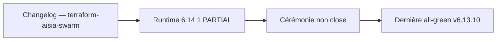

# Changelog — terraform-aisia-swarm

Format : [Keep a Changelog](https://keepachangelog.com/) · Versioning : SemVer AISIA-couplé.

## [6.14.1] — 2026-09-24

### Alignement de version — aucun changement fonctionnel

Les versions **6.12.81 à 6.14.1** ont été publiées sans entrée individuelle
dans ce changelog. Vérification faite au 2026-09-24 : sur cette plage, les
fichiers `.tf` de ce module n'ont reçu que des bandeaux de version et des
en-têtes de documentation. Aucune ressource, variable, sortie ni contrainte de
provider n'a été modifiée.

Écrire trente entrées rétroactives donnerait une fausse impression d'activité ;
cette entrée unique dit ce qui s'est réellement passé. L'historique détaillé
reste consultable dans Git et dans `specification/Versions/deploy-reports/`.

Le module suit la version du monorepo : son `VERSION` vaut **6.14.1**, comme
le produit. Ce couplage est délibéré — un module publié doit pouvoir être
rattaché sans ambiguïté à la release qui l'a produit.

## [Unreleased] — correction pré-publication (2026-08-05)

### Fixed
- `image_tag` default et `VERSION` rétablis à `v6.12.80` (dernière version AISIA
  **certifiée LIVE**, DEPLOY-REPORT all-green — `project_facts.json:prod_live_version`).
  Le commit `5a5ab47fa` (bump global « prepare v6.12.81 ») avait fait passer le default
  à `v6.12.81`, alors que cette version est encore 🟡 **PRÉPARÉE** (code seulement — build
  multi-arch, déploiement et DEPLOY-REPORT tous PENDING, cf.
  `artifacts/prepare-v6.12.81.md`). Le commit `8d818d7826e` avait déjà corrigé le texte
  de description (« ex. v6.12.80 ») et les exemples, mais pas la valeur fonctionnelle
  `default`, laissant le module publié avec une incohérence interne (README annonçait
  v6.12.80 partout, le default réel déployait v6.12.81 — tag d'image potentiellement
  inexistant sur `registry.aisia.fr`). Gate `run_terraform_modules_gate` de nouveau vert
  (`VERSION == prod_live_version`). ⚠️ **registry.terraform.io a déjà ingéré une version
  `6.12.81` immuable avec le défaut fautif** — cette correction locale ne la retire pas ;
  elle doit être republiée dans une future version (ex. `6.12.82`, une fois qu'une release
  AISIA plus récente que 6.12.80 est certifiée LIVE, ou via un hotfix dédié) pour que les
  nouveaux `terraform init` récupèrent le default sûr.

## [6.13.8] — 2026-08-23

### Changed
- Entrée rétroactive (TF-01, ajoutée 2026-08-24) : alignement de version sur AISIA v6.13.8 (versioning couplé, `VERSION` module → `6.13.8`, default `image_tag` → `v6.13.8`). Aucun changement fonctionnel des resources/variables/outputs. Dernière version courante du code (runtime LIVE = v6.13.1, non republiée sur le registry public à ce tag).

## [6.13.7] — 2026-08-22

### Changed
- Entrée rétroactive (TF-01, ajoutée 2026-08-24) : alignement de version sur AISIA v6.13.7 (versioning couplé, `VERSION` module → `6.13.7`, default `image_tag` → `v6.13.7`). Aucun changement fonctionnel des resources/variables/outputs.

## [6.13.6] — 2026-08-22

### Changed
- Entrée rétroactive (TF-01, ajoutée 2026-08-24) : alignement de version sur AISIA v6.13.6 (versioning couplé, `VERSION` module → `6.13.6`, default `image_tag` → `v6.13.6`). Aucun changement fonctionnel des resources/variables/outputs.

## [6.13.5] — 2026-08-22

### Changed
- Entrée rétroactive (TF-01, ajoutée 2026-08-24) : alignement de version sur AISIA v6.13.5 (versioning couplé, `VERSION` module → `6.13.5`, default `image_tag` → `v6.13.5`). Aucun changement fonctionnel des resources/variables/outputs.

## [6.13.4] — 2026-08-22

### Changed
- Entrée rétroactive (TF-01, ajoutée 2026-08-24) : alignement de version sur AISIA v6.13.4 (versioning couplé, `VERSION` module → `6.13.4`, default `image_tag` → `v6.13.4`). Aucun changement fonctionnel des resources/variables/outputs.

## [6.13.3] — 2026-08-22

### Changed
- Entrée rétroactive (TF-01, ajoutée 2026-08-24) : alignement de version sur AISIA v6.13.3 (versioning couplé, `VERSION` module → `6.13.3`, default `image_tag` → `v6.13.3`). Aucun changement fonctionnel des resources/variables/outputs.

## [6.13.2] — 2026-08-22

### Changed
- Entrée rétroactive (TF-01, ajoutée 2026-08-24) : alignement de version sur AISIA v6.13.2 (versioning couplé, `VERSION` module → `6.13.2`, default `image_tag` → `v6.13.2`). Aucun changement fonctionnel des resources/variables/outputs.

## [6.13.1] — 2026-08-21

### Changed
- Entrée rétroactive (TF-01, ajoutée 2026-08-24) : alignement de version sur AISIA v6.13.1 (versioning couplé, `VERSION` module → `6.13.1`, default `image_tag` → `v6.13.1`). Aucun changement fonctionnel des resources/variables/outputs. D'abord posée `6.13.01` (`57e174cc1`) puis normalisée `6.13.1` le même jour (`33dbb348c`).

## [6.12.101] — 2026-08-21

### Changed
- Entrée rétroactive (TF-01, ajoutée 2026-08-24) : alignement de version sur AISIA v6.12.101 (versioning couplé, `VERSION` module → `6.12.101`, default `image_tag` → `v6.12.101`). Aucun changement fonctionnel des resources/variables/outputs.

## [6.12.100] — 2026-08-21

### Changed
- Entrée rétroactive (TF-01, ajoutée 2026-08-24) : alignement de version sur AISIA v6.12.100 (versioning couplé, `VERSION` module → `6.12.100`, default `image_tag` → `v6.12.100`). Aucun changement fonctionnel des resources/variables/outputs.

## [6.12.99] — 2026-08-21

### Changed
- Entrée rétroactive (TF-01, ajoutée 2026-08-24) : alignement de version sur AISIA v6.12.99 (versioning couplé, `VERSION` module → `6.12.99`, default `image_tag` → `v6.12.99`). Aucun changement fonctionnel des resources/variables/outputs.

## [6.12.98] — 2026-08-20

### Changed
- Entrée rétroactive (TF-01, ajoutée 2026-08-24) : alignement de version sur AISIA v6.12.98 (versioning couplé, `VERSION` module → `6.12.98`, default `image_tag` → `v6.12.98`). Aucun changement fonctionnel des resources/variables/outputs.

## [6.12.97] — 2026-08-19

### Changed
- Entrée rétroactive (TF-01, ajoutée 2026-08-24) : alignement de version sur AISIA v6.12.97 (versioning couplé, `VERSION` module → `6.12.97`, default `image_tag` → `v6.12.97`). Aucun changement fonctionnel des resources/variables/outputs.

## [6.12.96] — 2026-08-18

### Changed
- Entrée rétroactive (TF-01, ajoutée 2026-08-24) : alignement de version sur AISIA v6.12.96 (versioning couplé, `VERSION` module → `6.12.96`, default `image_tag` → `v6.12.96`). Aucun changement fonctionnel des resources/variables/outputs.

## [6.12.95] — 2026-08-18

### Changed
- Entrée rétroactive (TF-01, ajoutée 2026-08-24) : alignement de version sur AISIA v6.12.95 (versioning couplé, `VERSION` module → `6.12.95`, default `image_tag` → `v6.12.95`). Aucun changement fonctionnel des resources/variables/outputs.

## [6.12.94] — 2026-08-17

### Changed
- Entrée rétroactive (TF-01, ajoutée 2026-08-24) : alignement de version sur AISIA v6.12.94 (versioning couplé, `VERSION` module → `6.12.94`, default `image_tag` → `v6.12.94`). Aucun changement fonctionnel des resources/variables/outputs.

## [6.12.93] — 2026-08-17

### Changed
- Entrée rétroactive (TF-01, ajoutée 2026-08-24) : alignement de version sur AISIA v6.12.93 (versioning couplé, `VERSION` module → `6.12.93`, default `image_tag` → `v6.12.93`). Aucun changement fonctionnel des resources/variables/outputs.

## [6.12.92] — 2026-08-16

### Changed
- Entrée rétroactive (TF-01, ajoutée 2026-08-24) : alignement de version sur AISIA v6.12.92 (versioning couplé, `VERSION` module → `6.12.92`, default `image_tag` → `v6.12.92`). Aucun changement fonctionnel des resources/variables/outputs.

## [6.12.91] — 2026-08-15

### Changed
- Entrée rétroactive (TF-01, ajoutée 2026-08-24) : alignement de version sur AISIA v6.12.91 (versioning couplé, `VERSION` module → `6.12.91`, default `image_tag` → `v6.12.91`). Aucun changement fonctionnel des resources/variables/outputs.

## [6.12.90] — 2026-08-14

### Changed
- Entrée rétroactive (TF-01, ajoutée 2026-08-24) : alignement de version sur AISIA v6.12.90 (versioning couplé, `VERSION` module → `6.12.90`, default `image_tag` → `v6.12.90`). Aucun changement fonctionnel des resources/variables/outputs.

## [6.12.89] — 2026-08-11

### Changed
- Entrée rétroactive (TF-01, ajoutée 2026-08-24) : alignement de version sur AISIA v6.12.89 (versioning couplé, `VERSION` module → `6.12.89`, default `image_tag` → `v6.12.89`). Aucun changement fonctionnel des resources/variables/outputs.

## [6.12.88] — 2026-08-11

### Changed
- Entrée rétroactive (TF-01, ajoutée 2026-08-24) : alignement de version sur AISIA v6.12.88 (versioning couplé, `VERSION` module → `6.12.88`, default `image_tag` → `v6.12.88`). Aucun changement fonctionnel des resources/variables/outputs. Release combinée v6.12.85→88 (`759799384`) : `6.12.86`/`6.12.87` n'ont jamais été posées dans le VERSION de ce module (saut direct 85→88).

## [6.12.85] — 2026-08-10

### Changed
- Entrée rétroactive (TF-01, ajoutée 2026-08-24) : alignement de version sur AISIA v6.12.85 (versioning couplé, `VERSION` module → `6.12.85`, default `image_tag` → `v6.12.85`). Aucun changement fonctionnel des resources/variables/outputs.

## [6.12.84] — 2026-08-09

### Changed
- Entrée rétroactive (TF-01, ajoutée 2026-08-24) : alignement de version sur AISIA v6.12.84 (versioning couplé, `VERSION` module → `6.12.84`, default `image_tag` → `v6.12.84`). Aucun changement fonctionnel des resources/variables/outputs.

## [6.12.83] — 2026-08-07

### Changed
- Entrée rétroactive (TF-01, ajoutée 2026-08-24) : alignement de version sur AISIA v6.12.83 (versioning couplé, `VERSION` module → `6.12.83`, default `image_tag` → `v6.12.83`). Aucun changement fonctionnel des resources/variables/outputs.

## [6.12.82] — 2026-08-06

### Changed
- Entrée rétroactive (TF-01, ajoutée 2026-08-24) : alignement de version sur AISIA v6.12.82 (versioning couplé, `VERSION` module → `6.12.82`, default `image_tag` → `v6.12.82`). Aucun changement fonctionnel des resources/variables/outputs.

## [6.12.81] — 2026-08-05

### Changed
- Entrée rétroactive (TF-01, ajoutée 2026-08-24) : alignement de version sur AISIA v6.12.81 (versioning couplé, `VERSION` module → `6.12.81`, default `image_tag` → `v6.12.81`). Aucun changement fonctionnel des resources/variables/outputs. ⚠️ Version ingérée par registry.terraform.io (immuable) avec le défaut `image_tag` corrigé ensuite — voir la section [Unreleased] ci-dessus.

## [6.12.80] — 2026-08-05

### Changed
- Sync `image_tag` default -> `v6.12.80` (release AISIA v6.12.80 LIVE, DEPLOY-REPORT
  all-green). Entrée rétroactive (bump réel non documenté au moment du commit
  `38058f47f`). Aucun changement fonctionnel des resources/variables/outputs.

## [6.12.79] — 2026-08-04

### Changed
- Sync `image_tag` default -> `v6.12.79` (bump AISIA patch, jamais déployé isolément —
  englobé par la chaîne v6.12.80). Entrée rétroactive (bump réel non documenté au moment
  du commit `0ac97ec9d`). Aucun changement fonctionnel des resources/variables/outputs.

## [6.12.78] — 2026-08-04

### Changed
- Sync `image_tag` default -> `v6.12.78` (release AISIA v6.12.78 LIVE). Rattrape aussi le
  saut `v6.12.77` (VERSION + image_tag bumpés en v6.12.77 par le commit `ad31e4ac8` sans
  entrée CHANGELOG, jamais publié au registry). Aucun changement fonctionnel des
  resources/variables/outputs (patch de synchronisation de version).

## [6.12.76] — 2026-08-02

### Changed
- Sync `image_tag` default -> `v6.12.76` (release AISIA v6.12.76 LIVE). Aucun changement
  fonctionnel des resources/variables/outputs (patch de synchronisation de version).

## [6.9.61] — 2026-06-30

### Added
- Module initial publiable (Terraform Registry) : déploiement de la stack AISIA
  sur un Docker Swarm **existant**, cloud-agnostique (bare-metal ARM64,
  VM cloud, hybride).
- **Parité dual-substrate** avec `terraform-aisia-cluster` (K8s) — comble le
  manque identifié dans la famille registry `ai-aisia-lab/infra/terraform-registry/`.
- **Services** : `aisia_api` (mode GLOBAL), `aisia_agent` (mode GLOBAL, GPU
  optionnel), `aisia_bot` (REPLICATED, tier-aware), `aisia_frontend` (REPLICATED,
  tier-aware — image `aisia-frontend`).
- **Réseau overlay** : `docker_network` attachable avec labels de traçabilité.
- **Rolling update sécurisé** : `update_parallelism=1`, `delay=60s`,
  `failure_action=rollback` par défaut (règle AISIA gravée dans le marbre
  suite à un retour d'expérience (cascade I/O sous parallélisme élevé)).
- **Traefik** : labels auto-générés (service-level) sur API et frontend
  si `domain` est fourni ; supporte le mode Swarm de Traefik v2/v3.
- **Tiers** (`free/saas/baas/paas`) : dérivation automatique des réplicas
  bot/frontend avec possibilité de surcharge explicite.
- **GPU** : contrainte `node.labels.gpu == true` sur l'agent si `gpu_enabled=true`
  (nœuds GPU / edge).
- **Déploiement ID** : `random_id.deploy_id` stable par `stack_name`,
  injecté comme label sur tous les services (traçabilité Terraform).
- **Healthchecks** : `wget --spider /health` sur l'API (endpoint public,
  cf. bonne pratique : healthcheck sur endpoint public) et `/` sur le frontend ; bot/agent sans
  healthcheck HTTP (workers Python sans serveur HTTP).
- Variables d'entrée normalisées : `docker_host`, `stack_name`, `image_tag`
  (default `v6.9.61`), `image_registry`, `image_frontend_name`, `domain`,
  `api_domain`, `tier`, `bot_replicas`, `frontend_replicas`, `gpu_enabled`,
  `extra_env`, `placement_*`, `update_parallelism`, `update_delay`,
  `network_driver`.
- Outputs : `stack_name`, `network_id`, `network_name`, `api_service_name`,
  `bot_service_name`, `agent_service_name`, `frontend_service_name`,
  `public_url`, `api_url`, `tier`, `effective_bot_replicas`,
  `effective_frontend_replicas`, `deploy_id`.
- README avec tableaux Inputs/Outputs, usage, prérequis, architecture.
- LICENSE MPL-2.0, VERSION 6.9.61, exemple `examples/basic`.
- Providers : `kreuzwerker/docker >= 3.0.2` + `hashicorp/random >= 3.5.0`.

## Relecture release 6.14.1

Revue du 2026-09-24 pour la release dont le code et le runtime mesuré sont **6.14.1**. `/health` répond 6.14.1, la classe publique est `LIVE_PARTIAL`, `ceremony_complete` est faux. La dernière cérémonie all-green scellée reste **v6.13.10**. Cette relecture ne ferme pas la cérémonie.

Document relu : Changelog — terraform-aisia-swarm.

Extrait conservé : Format : [Keep a Changelog](https://keepachangelog.com/) · Versioning : SemVer AISIA-couplé.

Ce fichier garde son rôle d'origine. S'il décrit une campagne, un changelog ou un modèle daté, cette date reste valable. Seul l'état de production ci-dessus est celui du 2026-09-24.

