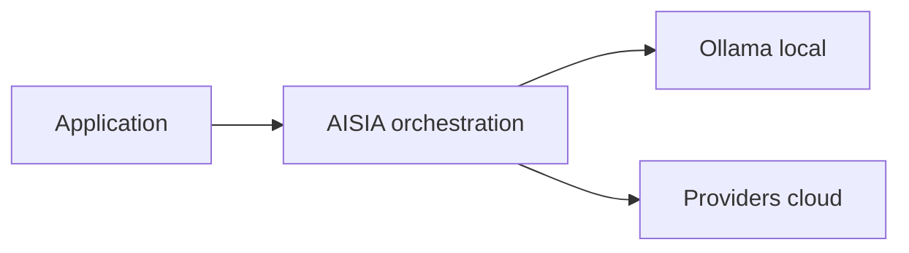

<!-- GENERATED:09_publications:start -->
<!--
  GÉNÉRÉ — ne pas éditer à la main.
  Source: scripts/generate/09_publications.py
  Régénérer: python3 scripts/aisia.py regen
  Gate deploy: python3 scripts/release/deploy.py <ver> --mode docs
-->

# terraform-aisia-swarm

> **v6.12.28** — module cœur — déployer AISIA sur Docker Swarm existant

## Cœur d'AISIA (identité produit)

AISIA est le **chef d'orchestre IA local-first** : une requête entre, le meilleur modèle (local ou cloud) exécute, la réponse sort traçable et gouvernée.

**Fonction première** : orchestrer chaque requête IA en **local-first** (Ollama sur cluster)
puis cloud si nécessaire — via `BanditRouter`, pas un simple reverse-proxy.

**Différenciation** : orchestration local-first — pas un proxy LLM stateless.

| vs proxy LLM | AISIA |
|--------------|-------|
| 1 provider fixe | **87** providers + **58** modèles locaux |
| Stateless | Qdrant + audit AI Act + multi-tenant |
| SaaS opaque | Déployable Swarm/K8s — **v6.12.28** LIVE |

Documentation : [README racine](../../../../README.md) ·
[Product Identity](../../../../specification/03-Project-State/Product-Identity-AISIA.md)




---
<!-- GENERATED:09_publications:end -->

## À propos d'AISIA

AISIA = orchestration d'IA **souveraine, local-first, multi-providers**. Elle route
chaque requête IA vers le meilleur modèle (cloud **ou** local) au meilleur coût,
sans lock-in, en gardant la maîtrise des données (RGPD/EU AI Act). **Problèmes
résolus** : coûts LLM (routage cost-aware + modèles locaux), lock-in
(providers unifiés + fallback), souveraineté (on-prem/cloud souverain, audit),
fiabilité (HA Swarm multi-nœuds), multi-tenant (SaaS/BaaS/PaaS).

> AISIA est une solution **propriétaire** (brevet / dépôt INPI). Ce module documente
> **comment déployer/exploiter** la plateforme, pas son architecture interne ni sa conception.

Publié sur le Terraform Registry sous `terraform-docker-aisia`.

## Architecture des services

| Service | Mode Swarm | Tier-aware | Image |
|---------|-----------|------------|-------|
| `<stack>_api` | GLOBAL (1/nœud worker api) | Non (global scale) | `registry/aisia:tag` |
| `<stack>_agent` | GLOBAL (+ contrainte GPU opt.) | Non (global scale) | `registry/aisia:tag` |
| `<stack>_bot` | REPLICATED | Oui | `registry/aisia:tag` |
| `<stack>_frontend` | REPLICATED | Oui | `registry/aisia-frontend:tag` |

Tous les services partagent un réseau **overlay attachable** (`<stack>_name`).
L'exposition publique passe par **Traefik** (labels service-level, mode Swarm).

## Usage

```hcl
provider "docker" {
  host = "ssh://user@swarm-manager.example.com"  # Swarm manager
}

module "aisia" {
  source  = "aisia-foundation/swarm/aisia"
  version = "~> 6.9"

  image_tag  = "v6.12.28"
  stack_name = "aisia"
  tier       = "saas"     # free | saas | baas | paas
  domain     = "client.aisia.fr"
  api_domain = "api.client.aisia.fr"

  placement_api      = ["node.labels.aisia-role == api"]
  placement_frontend = ["node.labels.aisia-role == frontend"]

  update_parallelism = 1
  update_delay       = "60s"
}
```

Voir [`examples/basic`](./examples/basic) pour un exemple complet.

## Tiers & scaling

Le `tier` dérive les bornes de réplicas par défaut (surcharge possible) :

| tier | bot replicas | frontend replicas |
|------|-------------|-------------------|
| free | 1 | 1 |
| saas | 1 | 2 |
| baas | 2 | 2 |
| paas | 2 | 4 |

L'API et l'agent sont en mode **GLOBAL** (une tâche par nœud satisfaisant les contraintes
de placement) — ils scalent automatiquement avec le cluster.

## Rolling update AISIA

Bonne pratique (un `--parallelism` élevé avec `--force`
sur un grand cluster peut provoquer une cascade I/O) :

```
update_parallelism = 1   # jamais >= 2 avec --force
update_delay       = "60s"
failure_action     = "rollback"
order              = "stop-first"
```

## Inputs

| Nom | Type | Défaut | Description |
|-----|------|--------|-------------|
| `docker_host` | string | `unix:///var/run/docker.sock` | URL du Swarm manager (informationnel — configurer le provider en amont) |
| `stack_name` | string | `aisia` | Préfixe des services Swarm |
| `image_registry` | string | `registry.aisia.fr` | Registry des images AISIA |
| `image_tag` | string | `v6.12.28` | Tag d'image (manifest multi-arch requis) |
| `image_frontend_name` | string | `aisia-frontend` | Nom de l'image frontend |
| `domain` | string | `""` | Domaine public frontend (vide = pas de labels Traefik) |
| `api_domain` | string | `""` | Domaine API (vide = `api.<domain>` si domain fourni) |
| `tier` | string | `saas` | `free`/`saas`/`baas`/`paas` — pilote le scaling |
| `bot_replicas` | number | `null` | Replicas bot (null = dérivé du tier) |
| `frontend_replicas` | number | `null` | Replicas frontend (null = dérivé du tier) |
| `gpu_enabled` | bool | `false` | Contrainte GPU sur l'agent (`node.labels.gpu == true`) |
| `extra_env` | map(string) | `{}` | Variables d'env supplémentaires (tous services backend) |
| `placement_api` | list(string) | `["node.role == worker"]` | Contraintes placement API |
| `placement_agent` | list(string) | `["node.role == worker"]` | Contraintes placement agent |
| `placement_bot` | list(string) | `["node.role == worker"]` | Contraintes placement bot |
| `placement_frontend` | list(string) | `["node.role == worker"]` | Contraintes placement frontend |
| `update_parallelism` | number | `1` | Tâches mises à jour en parallèle (toujours 1) |
| `update_delay` | string | `"60s"` | Délai entre lots de rolling update |
| `network_driver` | string | `"overlay"` | Driver réseau Docker |

## Outputs

| Nom | Description |
|-----|-------------|
| `stack_name` | Nom du stack Swarm déployé |
| `network_id` | ID du réseau overlay |
| `network_name` | Nom du réseau overlay |
| `api_service_name` | Nom du service API Swarm |
| `bot_service_name` | Nom du service bot Swarm |
| `agent_service_name` | Nom du service agent Swarm |
| `frontend_service_name` | Nom du service frontend Swarm |
| `public_url` | URL publique frontend (`https://<domain>` si fourni) |
| `api_url` | URL publique API (`https://<api_domain>` si fourni) |
| `tier` | Tier d'exploitation appliqué |
| `effective_bot_replicas` | Replicas bot effectifs (après dérivation tier) |
| `effective_frontend_replicas` | Replicas frontend effectifs (après dérivation tier) |
| `deploy_id` | ID unique de déploiement Terraform (label de traçabilité) |

## Prérequis

- Docker Swarm initialisé (`docker swarm init`) avec workers joints.
- Provider `kreuzwerker/docker` configuré avec `host` pointant vers le manager.
- **Traefik** déployé et attaché au réseau overlay si `domain` est fourni
  (mode SwarmProvider recommandé ; lire labels au niveau service).
- Images `registry.aisia.fr/aisia:<tag>` et `registry.aisia.fr/aisia-frontend:<tag>`
  disponibles — manifest multi-arch `arm64 + amd64` obligatoire sur cluster hybride.
- Nœuds labellisés (`aisia-role=api`, `aisia-role=frontend`) si `placement_*`
  personnalisés.

## Parité avec terraform-aisia-cluster

| Fonctionnalité | terraform-aisia-cluster (K8s) | terraform-aisia-swarm (Swarm) |
|----------------|-------------------------------|-------------------------------|
| API HA | Deployment + HPA | docker_service global |
| Réseau | Namespace + Service ClusterIP | docker_network overlay |
| Exposition | Ingress + cert-manager | Traefik labels |
| Scaling API | HPA CPU-based | Scale cluster (add workers) |
| Scaling bot/frontend | HPA | replicas tier-based |
| Rolling update | `strategy: RollingUpdate` | `update_config` parallelism=1 |
| Rollback | `kubectl rollout undo` | `rollback_config` auto |

## Requirements

| Name | Version |
|------|---------|
| terraform / opentofu | >= 1.5.0 |
| kreuzwerker/docker | >= 3.0.2 |
| hashicorp/random | >= 3.5.0 |

## Checklist publication registry

- [ ] repo GitHub nommé `terraform-docker-aisia`
- [ ] `tofu fmt -check` OK (module + examples)
- [ ] `tofu validate` OK (module + examples)
- [ ] README inputs/outputs/usage + examples présents
- [ ] LICENSE MPL-2.0 présent
- [ ] tag git `v6.12.28` poussé
- [ ] repo connecté sur registry.terraform.io (Publish Module)

## Licence

MPL-2.0 — voir [LICENSE](./LICENSE).

## Référence des variables & sorties (auto-générée)

<!-- BEGIN_TF_DOCS -->
<!-- END_TF_DOCS -->

<!-- TF-MODULE-DOCS:09_publications -->
## Documentation AISIA

- **Documentation produit** : [aisia.fr/docs](https://aisia.fr/docs)
- **Référence API** : [api.aisia.fr/docs](https://api.aisia.fr/docs)
- **Provider Terraform** : [aisia-foundation/aisia](https://registry.terraform.io/providers/aisia-foundation/aisia/latest/docs)
- **Guide d'implémentation** : [getting-started](https://registry.terraform.io/providers/aisia-foundation/aisia/latest/docs/guides/getting-started)
- **Version LIVE** : **v6.12.28**
